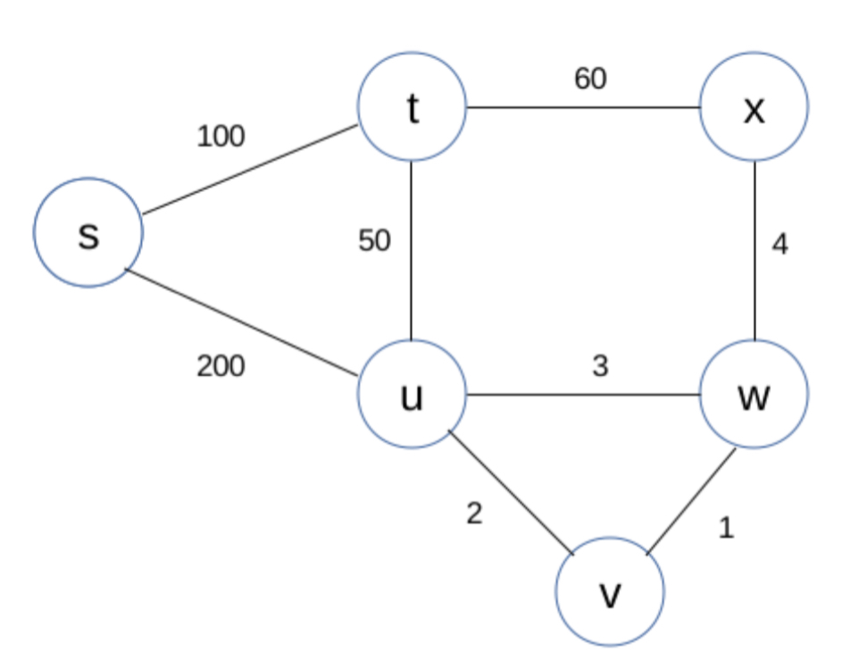
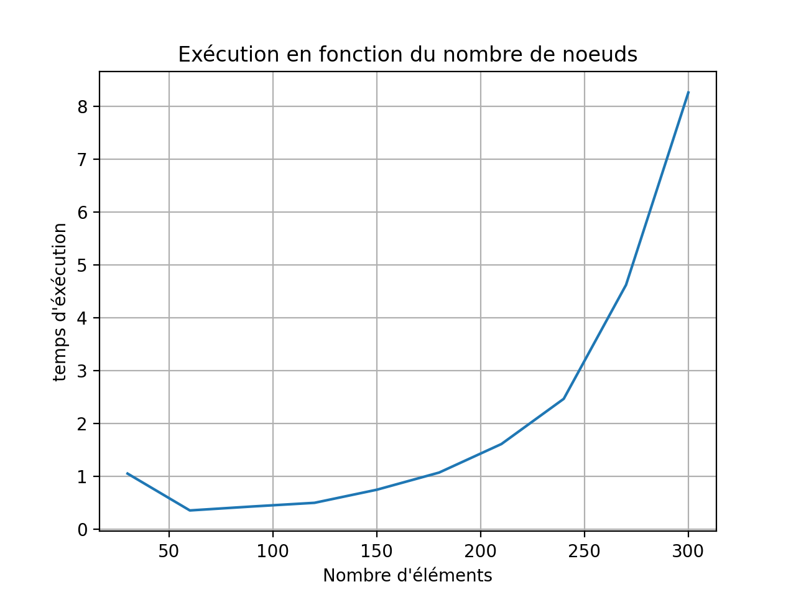

# Projet ELP dijkstra_go
## Objectifs du projet :
Créer en go un soft client serveur (TCP) pour retourner la liste des chemins les plus courts pour un graph donné (*utlisation de l'algorithme de Dijkstra*)

Les grandes étapes de l'exécution :

1. Génération et écriture du graph à traiter (in.txt) (par `graphGenerator.go`)
2. Extraction des données du graph puis envoi au serveur (par `client.go`)
3. Execution de l'algorithme de Dijkstra (par `server.go`)
    - récupération et traitement des données envoyés par le client
    - décomposition en go routine de l'éxecution de 1 vers N noeuds (N fois pour couvrir tout notre graph)
    - puis renvois des résultats au client
4. Reception des résultats de l'algo par le client et écriture du fichier de sortie (out.twt) (par `client.go`)

On utilise une implémentation client server TCP pour bénéficier de la fiabilité du protocole.
En effet, nous ne pouvons pas nous permettre de perdre des données (par exemple avec UDP), comme chacune d'elle est importante.

# Solution(s) retenue(s) pour chacune des étapes

## 1. Ecriture et génération du graph (par `graphGenerator.go`)
Solution retenue :

Un lien par ligne (2 noeuds (int) et un poids) et on utilise un code pour signifier le `EOF`

	7 9 2
	9 7 56
	4 1 6
	1 4 3
	. . .
	
*`. . .`  signifie EOF*

## 2. Extraction des données du graph puis envoi au serveur (par `client.go`)

Tout bêtement, on parse le fichier donné en argument et on l'envoie à notre serveur.

Ici aucun traitement n'est fait, on gère juste l'envoi en TCP de manière classique

## 3. Execution de l'algorithme de Dijkstra (par `server.go`)

### A. Réception par le serveur : Utilisation de Slice et de Struct

<u>Type de donnée :</u>

On définit un type de donnée composé d'un ``from`` d'un ``to`` et d'un ``weight``, qui sont tous des int.

    type elementGraph struct {
    	from   int
    	to     int
    	weight int
    }

<u>Traitement par le serveur :</u>

Le serveur récupère les données fournies par le client et les ajoute à un slice d'<code>elementGraph</code>

Par la même occasion, le serveur prépare un tableau trié (slice) contenant chaque noeud (de manière unique)

*Exemple de slice*

	[{1 2 1} {2 1 2} {7 8 3} {8 7 2} {2 9 3} {9 2 4} {5 6 2} {6 5 3} {3 2 3} {2 3 5}]

Avantages : 
- Facile à implémenter
- Clair à l'usage

Inconvénients :
- Difficile (à priori) d'accéder aux lien d'un noeud donné

### B. Algorithme de Dijsktra

**Pour un point donné vers les autre point**

Voici à quoi ressemble l'objet chemin utilisé dans dijsktra contenant le point de départ et le poid total associé au chemin emprunté :

    type chemin struct {
    	from   int
    	weight int
    }
    
 Voici les éléments contenant nos structures de données
 
    ways := make(map[int][]int)    //va contenir tous les chemins du style [1] : [2,5,7,9] , [2] : [1,4,8] , …
    
    distances := make(map[int]int) //distance totale parcourue pour un point donné : [1] : 6, [2] : 2, …
    
    dijksTAB := make(map[int][]chemin) // contient en gros tout le travail (équivalent à notre tableau à la main)
    
    deadPoints := make(map[int]int)    //nom des noeuds par lesquels on ne peut pas repasser
    
    neighbors := getAllNeighbors(graph, noeuds) //voisins de tous les noeuds

**Voici les grandes lignes du déroulement de l'algo dijkstra**

1. Récupérer la liste des lettres (triée de la plus petite à la plus grande)
2. Récupérer les voisins (noeuds avec lesquelles on a un lien)
3. Récupèration du point contenant la distance la plus courte
4. Récupération des chemins possibles depuis ce point

--> Ainsi en exécutant plusieurs fois cet algo en goroutines en partant de chaques noeuds possibles, on a bien le résulats des N noeuds vers N noeuds

**Récupération des chemins et de leur poids**

Il suffit maintenant de parcourir à l'inverse les chemins, pour calculer les poids totaux 
(On passe par un reverse du tableau ways contenants les différents noeuds)

### C. Renvois des données au client

Enfin, pour finir on renvois les données résultats au client sous la forme de strings

## 4. Reception des résultats de l'algo par le client et écriture du fichier de sortie (out.twt)

On récupère ici les données renvoyées par le server sous la forme de string, que l'on écrit dans un fichier out.txt
Ces dernières sont formatées ainsi :

    D H [D H] 1  
    D K [D X K] 2 

# Exemples et résultats :

Soit le graph suivant :

Le fichier d'entrée associé est le suivant (où s-t-u-v-w-x => 1-2-3-4-5-6):

    1 2 100
    2 1 100
    1 3 200
    2 1 200
    2 3 50
    3 2 50
    2 6 60
    6 2 60
    3 4 2
    4 3 2
    3 5 3
    5 3 3
    4 5 1
    5 4 1
    5 6 4
    6 5 4
    . . .

Une résolution "à la main" de l'algorithme de Dijkstra du point S (1) au point X (6) donne le résultat suivant :

|Tour \  Sommet   | 1   | 2   | 3  | 4 | 5 | 6 |
|:-:|:------:|:-----:|:----:|:-------:|:------:|:------:|
| 1 | 0 | ∞ |  ∞  |   ∞  |  ∞   | ∞ |
| 2 | X | **100 1** | 200 1 |   ∞  |  ∞   | ∞ |
| 3 | X | X | **150 2** |   ∞  |  ∞ | 160 2 |
| 4 | X | X | X |   152 3   |  **152 3**  | 160 2 |
| 5 | X | X | X |     X     |  153 4 | 160 2 |
| 6 | X | X | X |     X     |  X | **157 5** |

Voici le résultat dans le fichier de réponse :

    1 4 [1 2 3 4] 152
    1 5 [1 2 3 5] 153
    1 6 [1 2 3 5 6] 157
    1 1 [1 1] 0
    1 2 [1 2] 100
    1 3 [1 2 3] 150
    2 5 [2 3 5] 53
    2 6 [2 3 5 6] 57
    2 1 [2 1] 100
    2 2 [2 2] 0
    2 3 [2 3] 50
    2 4 [2 3 4] 52
    3 4 [3 4] 2
    3 5 [3 5] 3
    3 6 [3 5 6] 7
    3 1 [3 2 1] 150
    3 2 [3 2] 50
    3 3 [3 3] 0
    4 1 [4 3 2 1] 152
    4 2 [4 3 2] 52
    4 3 [4 3] 2
    4 4 [4 4] 0
    4 5 [4 5] 1
    4 6 [4 5 6] 5
    5 1 [5 3 2 1] 153
    5 2 [5 3 2] 53
    5 3 [5 3] 3
    5 4 [5 4] 1
    5 5 [5 5] 0
    5 6 [5 6] 4
    6 1 [6 5 3 2 1] 157
    6 2 [6 5 3 2] 57
    6 3 [6 5 3] 7
    6 4 [6 5 4] 5
    6 5 [6 5] 4
    6 6 [6 6] 0

# Performances et compléxité

Nous avons créé un programme qui calcul le temps d'execution du programme en fonction du nombre de noeuds d'entrée.

Le résultat prend en compte la totalité de l'application (connection et deconnection au server, l'ouverture et l'écriture dans les fichiers, …) et  non seulement le disjkstra.

Nous avons utilisé au maximum des map (par rapport à des listes) pour diminuer la compléxité.

 

 

### Quelques liens utiles au projet :

[Qu'est ce que l'algo de Dijkstra](https://www.youtube.com/watch?v=rHylCtXtdNs)

[Exemple de Dijkstra en Go](https://github.com/RyanCarrier/dijkstra)
